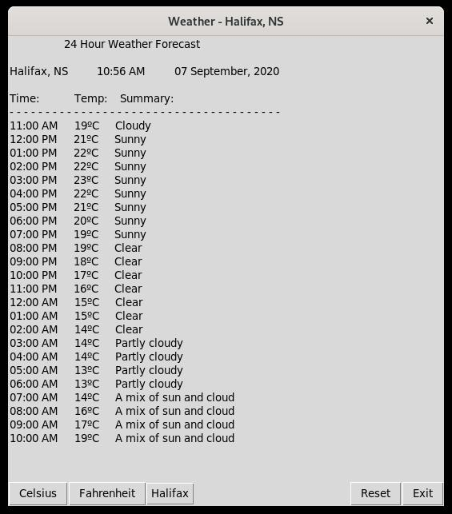

# Python Weather Application w/ GUI

This project is a weather aggregate that pulls in weather predictions from the Government of Canada's [weather service](https://weather.gc.ca/) and displays them in a table. It is currently hard-coded with a selection of regions in the province of Nova Scotia and presents the data in an hour-by-hour format.

## Getting Started

These instructions will get you a copy of the project up and running on your local machine for development and testing purposes.

### Prerequisites

```
Python 3.X, Copyright 2001-2020, Python Software Foundation
```
See [requirements](requirements.txt) for specific packages and versions

### Installing

You will need to have Python 3 installed as well as all packages found in the [requirements](requirements.txt) file.

Enter the following line into your command terminal to see which version of Python you have installed. Users of MacOS and Linux most likely already have some version of Python 3 on their machine. If not, please see installation instruction at [python.org](https://docs.python.org/3/).

```
python --version
```

In order to install the required packages please enter the following into your command terminal while inside of the project folder:

```
pip install -r requirements.txt
```



## Built With

* [Sublime-Text](http://www.sublimetext.com/docs/3/) - Development environment
* [Git](https://git-scm.com/) - Version Control System

## Authors

* **N.T. Carruthers**  - [GitHub](https://github.com/gif007)

## License

This project is licensed under the MIT License - see the [LICENSE.md](LICENSE.md) file for details

## Acknowledgments

* Hat tip to [Al Sweigart](https://twitter.com/AlSweigart?ref_src=twsrc%5Egoogle%7Ctwcamp%5Eserp%7Ctwgr%5Eauthor) for the great Python learning material
* A big thanks to Mark Lutz and his introduction to GUI programming in [Programming Python](https://books.google.ca/books/about/Programming_Python.html?id=tN7JAceyJdUC&source=kp_book_description&redir_esc=y)